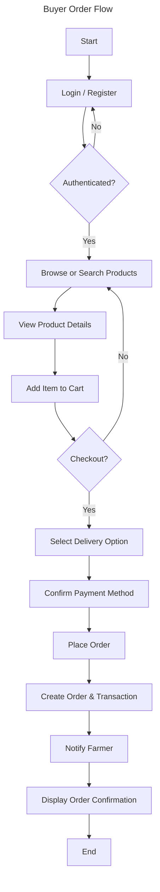
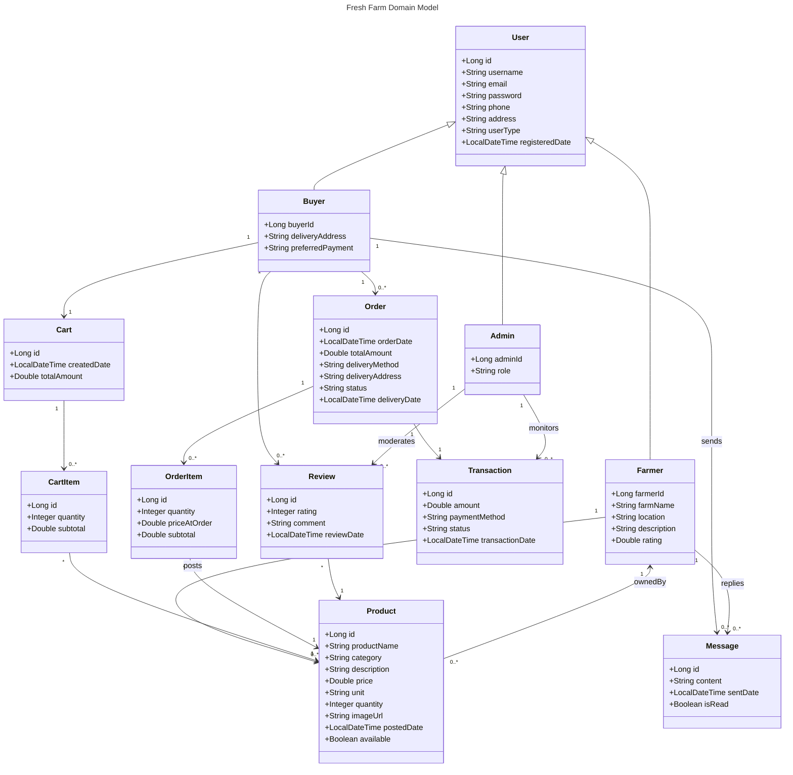

## Fresh Farm Produce Marketplace – Core Diagrams

### Use Case Diagram
```mermaid
---
title: Fresh Farm Use Cases
---
usecaseDiagram
    actor Farmer
    actor Buyer
    actor Admin

    rectangle Platform {
        Farmer --> (Register / Login)
        Farmer --> (Post / Update Product)
        Farmer --> (Remove Product)
        Farmer --> (View Orders)
        Farmer --> (Update Order Status)
        Farmer --> (Respond to Messages)

        Buyer --> (Register / Login)
        Buyer --> (Browse & Search Products)
        Buyer --> (Add to Cart)
        Buyer --> (Place Order)
        Buyer --> (View Order History)
        Buyer --> (Send Message)
        Buyer --> (Rate Product)

        Admin --> (Manage Users)
        Admin --> (Monitor Transactions)
        Admin --> (Manage Platform Settings)
        Admin --> (Resolve Disputes)
        Admin --> (Generate Reports)
    }
```

### Activity Diagram – Buyer Places Order


### Class Diagram


These diagrams provide the shared vocabulary needed before diving into the Spring Boot + React implementation.

